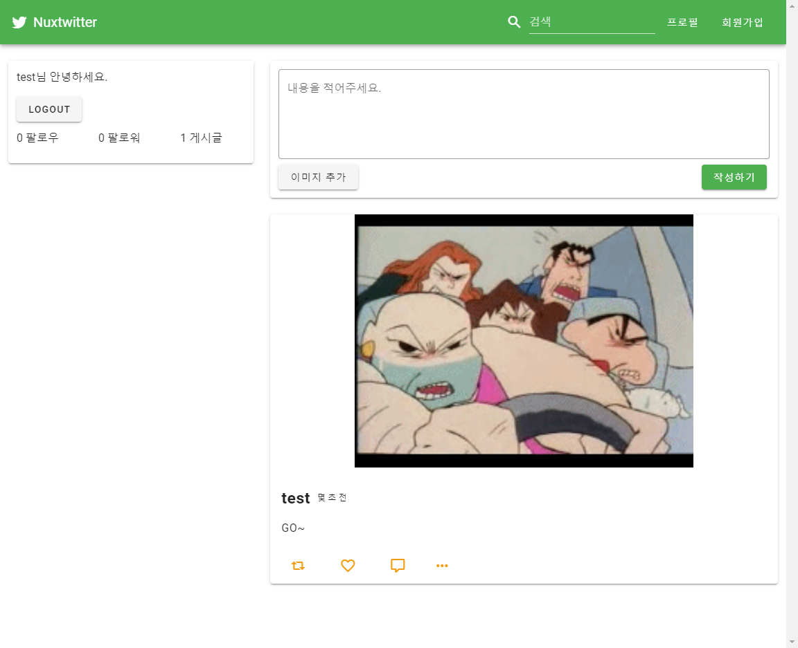

# Nuxt 트위터 클론 코딩

## 📸스크린샷

<details>
  
</details>

## 🧱설치 방법

### 프론트엔드

```bash
cd front

npm install

# for dev
npm start

# for build & nuxt start
npm run serve
```

### 백엔드

* [MySql의 설치](https://thebook.io/080229/ch07/02/) 필요

```bash
cd back

npm install

npm start
```
## 📌기능

- [x] 게시글 보기, 작성, 수정, 삭제
- [x] 회원가입, 로그인, 로그아웃
- [x] 팔로우, 언팔로우
- [x] 닉네임 수정
- [x] 이미지 업로드
- [x] 해시태그 기반 검색
- [x] 리트윗, 좋아요, 댓글
- [ ] 배포

## 기타

> 배포는 계획에 없어서 패-스